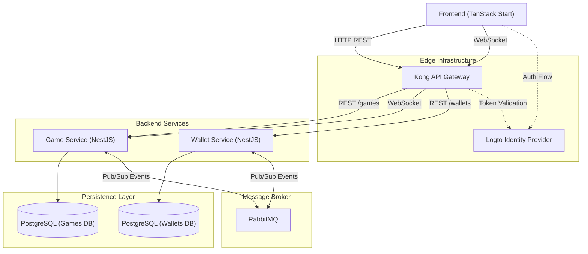

# Project architecture

The Crash Game architecture follows the principles of microservices and
Domain-Driven Design (DDD). The services are isolated, scalable, and
communicate both synchronously and asynchronously.

## Topology overview

## Bounded contexts

### 1. Game service

This service is responsible for the game engine.

- **Domain**: Rounds, Bets, Crash points, Provably fair algorithm.
- **Responsibilities**: Manage the round life cycle (waiting, flying, crashed),
  accept bets (verifying the balance asynchronously or eventually), calculate
  cash outs, and send real-time updates to the clients via WebSockets.

### 2. Wallet service

This service is responsible for the transactional control of the players' funds.

- **Domain**: Wallets, Transactions (debits, credits).
- **Responsibilities**: Maintain the balance and process debits (bets) and
  credits (withdrawals and wins). **Golden rule**: Handle monetary values
  strictly as integers (`BIGINT`) representing cents.

## Communication flow

- **Synchronous (REST)**: Frontend queries, such as fetching the balance,
  fetching the round history, and creating a wallet. Kong handles
  authentication and validation at the gateway. Wallet credit and debit are
  **never** exposed over REST.
- **Asynchronous (event-driven)**: Transactional processes between Game and
  Wallet flow only through RabbitMQ.
  - When a user places a bet via a REST request to the Game Service, the Game
    Service persists the bet as `PENDING` and emits a `BetPlaced` event.
  - The Wallet Service consumes the event, debits the balance (or rejects it if
    insufficient), and emits a `WalletDebited` or `WalletDebitFailed` event.
  - The Game Service compensates for the action if it fails: the bet
    transitions to `CANCELLED`.
  - On cash out, the Game Service emits `PlayerWon`; the Wallet Service credits
    the payout.

Event publication must use the **transactional outbox** pattern so a message
is never published without its state change being committed first (see
[patterns/backend.md](./patterns/backend.md)). Consumers must be idempotent —
duplicate deliveries are expected.

## Infrastructure topology

| Service        | Direct port | Through Kong                      |
| -------------- | ----------- | --------------------------------- |
| Frontend       | `3000`      | —                                 |
| Game Service   | `4001`      | `http://localhost:8000/games/*`   |
| Wallet Service | `4002`      | `http://localhost:8000/wallets/*` |
| Kong proxy     | `8000`      | —                                 |
| Kong admin     | `8001`      | —                                 |
| PostgreSQL     | `5432`      | databases: `games`, `wallets`     |
| RabbitMQ AMQP  | `5672`      | management UI on `15672`          |

`bun run docker:up` must bring everything up with no manual steps: Logto
realm/tenant import, Kong declarative config, and database migrations all run
as part of the compose lifecycle.

## Technology stack

- **Runtime and package manager**: Bun
- **Backend web framework**: NestJS with MikroORM for persistence
- **Frontend web framework**: TanStack Start (hybrid SSR/SPA)
- **API gateway**: Kong
- **Authentication**: Logto (OpenID Connect) — replaces the Keycloak default
  from the challenge spec under the same OIDC contract
- **Message broker**: RabbitMQ
